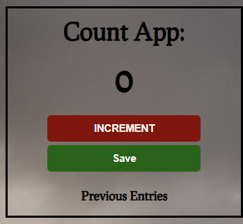

# Counter Application

A simple, interactive counter application built with HTML, CSS, and JavaScript that allows users to track counts and save previous entries.



## 🚀 Features

- Increment counter with a single click
- Save count history
- Clean and responsive design
- Real-time count display
- Previous entries tracking
- Reset functionality

## 📋 Prerequisites

- Any modern web browser (Chrome, Firefox, Safari, Edge)
- Basic text editor or IDE (VS Code, Sublime Text, etc.)

## 🛠️ Installation

1. Clone the repository or download the files:

```bash
git clone https://github.com/kiganyamburu/Count-App
```

2. Project Structure:

```
counter-app/
│
├── index.html
├── styles.css
└── script.js
```

## 💻 Usage

1. Open `index.html` in your web browser
2. Click the "INCREMENT" button to increase the count
3. Click "SAVE" to store the current count and reset the counter
4. View previous entries below the counter

## 📄 Code Structure

### HTML (index.html)

```html
<!DOCTYPE html>
<html lang="en">
  <head>
    <meta charset="UTF-8" />
    <meta name="viewport" content="width=device-width, initial-scale=1.0" />
    <title>Counter App</title>
    <link rel="stylesheet" href="styles.css" />
  </head>
  <body>
    <div class="container">
      <h1>Counter</h1>
      <h2 id="count-el">0</h2>
      <button id="increment-btn" onclick="increment()">INCREMENT</button>
      <button id="save-btn" onclick="save()">SAVE</button>
      <p id="save-el">Previous entries:</p>
    </div>
    <script src="script.js"></script>
  </body>
</html>
```

### CSS (styles.css)

```css
body {
  font-family: system-ui, -apple-system, sans-serif;
  text-align: center;
  background-color: #f0f2f5;
  margin: 0;
  padding: 20px;
}

.container {
  max-width: 400px;
  margin: 0 auto;
  background-color: white;
  padding: 20px;
  border-radius: 10px;
  box-shadow: 0 2px 4px rgba(0, 0, 0, 0.1);
}

h1 {
  color: #2b2d42;
  margin-bottom: 20px;
}

#count-el {
  font-size: 50px;
  margin: 20px 0;
  color: #2b2d42;
}

button {
  background-color: #4361ee;
  color: white;
  padding: 10px 20px;
  border: none;
  border-radius: 5px;
  margin: 5px;
  cursor: pointer;
  font-size: 16px;
  transition: background-color 0.3s;
}

button:hover {
  background-color: #3046c5;
}

#save-el {
  margin-top: 20px;
  color: #2b2d42;
}
```

### JavaScript (script.js)

```javascript
let saveEl = document.getElementById("save-el");
let countEl = document.getElementById("count-el");
let count = 0;

function increment() {
  count += 1;
  countEl.textContent = count;
}

function save() {
  let countStr = count + " - ";
  saveEl.textContent += countStr;
  countEl.textContent = 0;
  count = 0;
}
```

## 🔧 Customization

You can customize the app by:

1. Modifying the CSS styles to match your brand colors
2. Adding new features like:
   - Decrement button
   - Clear history button
   - Custom increment values
   - Local storage integration

## 🤝 Contributing

1. Fork the project
2. Create your feature branch (`git checkout -b feature/AmazingFeature`)
3. Commit your changes (`git commit -m 'Add some AmazingFeature'`)
4. Push to the branch (`git push origin feature/AmazingFeature`)
5. Open a Pull Request

## 📝 License

This project is licensed under the MIT License - see the LICENSE.md file for details

## 👤 Author

Your Name

- GitHub: [kiganyamburu](https://github.com/kiganyamburu)
- LinkedIn: [Peter mburu](https://www.linkedin.com/in/kiganya-mburu-53a7b5231/)

## 🙏 Acknowledgments

- Inspiration from various counter applications
- Thanks to all contributors who help improve the project
